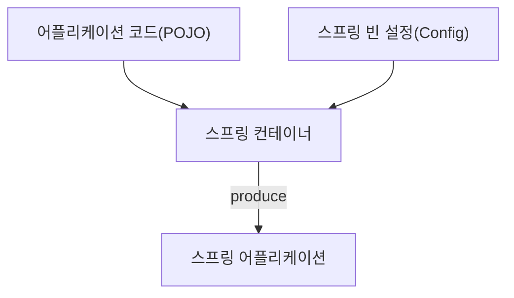

# hello-spring
토비의 스프링 6 - 이해와 원리 학습 레포지토리입니다.

## 스프링으로 어떻게 개발할 것인가?

일단 만들어보면서 필요한 것을 찾아가는 방식으로 개발한다.

스프링 어플리케이션 개발은
- 어플리케이션 코드를 설계하고, 스프링 빈을 선정
- 구성정보 메타데이터 작성
- 스프링 컨테이너 준비

스프링 어플리케이션이 만들어지는 구조

## 스프링 구성정보 메타데이터

- 스프링 빈의 정의 (클래스, 이름, 생성자, 프로퍼티, 오토와이어링)
- 어노테이션 기반 구성정보 (@Component, @Autowired)
- 자바 기반 구성정보 (@Configuration, @Bean)
- 자동 구성정보 (@AutoConfiguration) - Spring Boot

https://docs.spring.io/spring-framework/reference/core/beans.html

[토비의 스프링 부트](https://www.inflearn.com/course/%ED%86%A0%EB%B9%84-%EC%8A%A4%ED%94%84%EB%A7%81%EB%B6%80%ED%8A%B8-%EC%9D%B4%ED%95%B4%EC%99%80%EC%9B%90%EB%A6%AC)

## 스프링이 제공하는 인프라 빈 활용
- 스프링부트의 자동 구성과 프로퍼티 설정을 통해서 활용
- 자동 구성에 의해 내부에서 만들어지는 빈 구조 이해
- 프로퍼티 구성정보를 이용한 커스터마이징
- @Bean 오버라이딩을 이용한 구성
- @Enable로 시작하는 기능

## 스프링의 각 모듈 기술 활용
- 스프링과 이에 대응되는 스프링 부트의 기능을 함꼐 학습
- 테스트
- 데이터 액세스 (JDBC, JPA)
- 웹 MVC
- Rest Client 4가지 (RestTemplate, WebClient, FeignClient, OKHttp&Retrofit)
- 테스트 실행, 스케쥴링
- 캐시
- 리액티브 (WebFlux)

## 스프링이 지원하는 언어
- Java
- Kotlin
- Groovy

## 스프링 프로젝트 / 생태계
- Spring Boot
- Spring Data
- Spring Security
- Spring Cloud
- Spring Session
- Spring Integration
- Spring Modulith
- Spring Batch
- Spring AI
- ...
